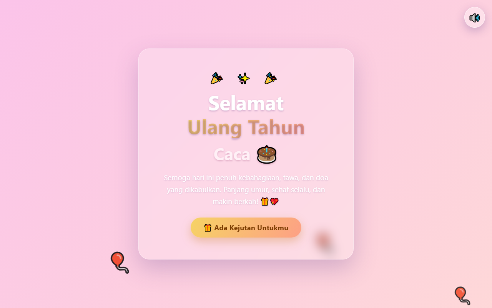

# 🎂 Website Ucapan Ulang Tahun untuk Caca

Website statis ucapan selamat ulang tahun yang interaktif dan penuh kejutan —
dibuat murni dengan HTML, CSS, dan JavaScript tanpa dependensi apa pun.

## ✨ Fitur

- 🎵 Musik "Selamat Ulang Tahun" otomatis mengalung saat halaman dibuka
  (disintesis via Web Audio API — tanpa file MP3)
- 🖼️ Galeri kenangan 3 foto dengan popup lightbox dan latar belakang blur
- 🎉 Ledakan konfeti spesial ±2 detik setelah semua foto dibuka
- 💖 Kartu ucapan interaktif — klik untuk efek hati beterbangan
- 🎈 Balon mengambang, gradien pastel, dan tombol toggle musik 🔊/🔇

## 🌐 Lihat Live

https://rofiwahyu.github.io/ucapan-ultahv2/

## ▶️ Menjalankan Secara Lokal

Cukup buka `index.html` di browser, atau gunakan Live Server (VS Code) /
`python -m http.server` lalu akses http://localhost:8000.

## 📁 Struktur Proyek

    index.html          — halaman utama ucapan
    kejutan.html        — halaman kejutan (galeri + pesan)
    css/style.css       — styling utama
    css/kejutan.css     — styling halaman kejutan
    js/music.js         — melodi Web Audio API
    js/confetti.js      — animasi konfeti canvas
    js/interaksi.js     — lightbox, reveal, efek hati
    assets/             — foto galeri & screenshot

## 📝 Kustomisasi

- **Ganti foto:** timpa `assets/foto1.jpg` – `foto3.jpg` dengan nama sama
- **Ubah teks ucapan/kesan/doa:** edit langsung di `kejutan.html`
- **Panduan AI agent:** lihat [AGENT.md](AGENT.md)
